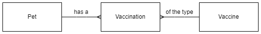

# Database Design and Development

## Notes

All the code examples use SQLite.  They will work with [DB Browser for SQLite](https://sqlitebrowser.org/).

These notes are focused on Higher Computing Science so some terms are used differently.

### Example Data

The example [database](H-CS-Database.db) contains the tables and records that the SQL examples will work with.  The file can be opened with [DB Browser for SQLite](https://sqlitebrowser.org/).

Four records from each table used in the examples are shown below.


#### Table: Pet

| petID | name     | species | dob |
| ----- | ----     | ------- | --- |
| 1     | Hans     | Cat     | 2015-09-22 |
| 2     | Minnnie  | Gerbil  | 2021-05-24 |
| 3	    | Bo       | Rabbit  | 2011-10-13 |
| 4     | Joscelin | Gerbil  | 2022-02-19 |


####  Table: Vaccination

| petID | vaxID | vaxDate    | reaction | paid |
| ----- | ----- | -------    | -------- | ---- |
| 2     | 4     | 2021-11-06 | FALSE    | FALSE |
| 20    | 9     | 2021-09-05 | FALSE    | FALSE |
| 19    | 2     | 2021-07-06 | FALSE    | FALSE |
| 9     | 8     | 2021-03-05 | FALSE    | FALSE |


#### Table: Vaccine

| vaxID | name                   | cost |
| ----- | ----                   | ---- |
| 1     | Canine hepatitis       | 27.55 |
| 2     | Cat Flu                | 19.30 |
| 3     | Distemper              | 34.75 |
| 4     | Feline Leukaemia Virus | 25.35 |

#### ER Diagram



## Wildcards

Wildcards use the `LIKE` keyword, and are used with `WHERE`.  There are two wildcards:

| Symbol | Name       | Meaning |
| :----: | ----       | ------- |
| %      | Percent    | Zero, one, or more characters |
| _      | Underscore | A single character |

Zero, one, or more characters, after the first character.

``` sql
SELECT *
    FROM Pet
    WHERE name LIKE "G%";
```
Zero, one, or more characters, before the last character.

``` sql
SELECT *
    FROM Pet
    WHERE name LIKE "%n";
```

Zero, one, or more characters in the middle.

``` sql
SELECT *
    FROM Pet
    WHERE species LIKE "R%t";
```

A single character.

``` sql
SELECT *
    FROM Pet
    WHERE species LIKE "_at";
```

## Alias

To display search results with a different column heading instead of the field name the `AS` keyword is used.

``` sql
SELECT name AS Jag, cost
    FROM Vaccine;
```

The alias can be used within the statement.

``` sql
SELECT name AS Jag, cost
    FROM Vaccine
    WHERE Jag LIKE "F%"
    ORDER BY Jag DESC;
```

Aliases are not restricted to single words.  Due to the space, square brackets are used.

``` sql
SELECT petID, name, species, dob AS [Date of Birth]
    FROM Pet
    ORDER BY [Date of Birth] ASC;
```

## Computed values

``` sql
SELECT name, cost, cost * 1.2 AS [inc VAT]
    FROM Vaccine
    ORDER BY name ASC;
```

## Aggregate functions

Aggregate functions can be used with the `GROUP BY` clause.

### Minimum / Maximum

The `MIN` keyword is used to find the minimum value in a field, and `MAX` is used to find the maximum.  These work for both numeric and text values.

Find the `dob` of the oldest and youngest pet.

``` sql
SELECT MIN(dob), MAX(dob)
    FROM Pet;
```

### Average

``` sql
SELECT AVG(cost)
    FROM Vaccine;
```

### Sum

``` sql
SELECT SUM(cost)
    FROM Vaccination, Vaccine
    WHERE vaccination.vaxID = vaccine.vaxID
        AND pet_id = 14;
```

### Count

Count the number of records in a table that meet the condition.

``` sql
SELECT COUNT(*)
    FROM Pet
    WHERE species = "Rabbit";
```

## GROUP BY

`GROUP BY` places results of a query into logical groups and removes duplicates.  Aggregate functions can be used with each group.

The following example will return the `species` field from every record.  Values will be repeated if they are repeated in the table.

``` sql
SELECT species
    FROM Pet;
```

The following example will group together `species` field from every record.  Values will not be repeated, i.e. one row for each group.

``` sql
SELECT species
    FROM Pet
    GROUP BY species;
```

**Note:** If fields and aggregate functions are both displayed then the fields must be in the `GROUP BY` clause, otherwise the result is meaningless.

``` sql
SELECT species, MIN(dob), MAX(dob)
    FROM Pet
    GROUP BY species;
```

## ORDER BY

`ORDER BY`, if used, must follow `GROUP BY`.

``` sql
SELECT species, COUNT(species)
    FROM Pet
    GROUP BY species
    ORDER BY COUNT(species) DESC;
```

## WHERE

It is possible to use the result from an aggregate function in a `WHERE` clause, but not directly.

A `VIEW` stores the result of a `SELECT` statement.  The view can then be queried like a table.

### Using a result in another query

This will create a temporary view that will be deleted when the database is closed.

``` sql
CREATE TEMP VIEW oldest (dob) AS
    SELECT MIN(doB)
    FROM pet;
```

Use the stored result.

``` sql
SELECT pet.name, vaccine.name, vaxDate, cost
    FROM oldest, pet, vaccination, vaccine
    WHERE pet.petID = vaccination.petID
        AND vaccination.vaxID = vaccine.vaxID
        AND oldest.dob = pet.dob;
```

### Subclause (Single query)

**Note** Using subclauses is beyond the scope of the Higher course and will not be assessed.

``` sql
SELECT pet.name, vaccine.name, vaxDate, cost
    FROM pet, vaccination, vaccine
    WHERE pet.petID = vaccination.petID
        AND vaccination.vaxID = vaccine.vaxID
        AND pet.dob = 
            (SELECT MIN(doB)
                FROM pet);
```

## Examples

``` sql
SELECT species, COUNT(*) as jags
    FROM pet, vaccination
    WHERE pet.petID = vaccination.vaxID
        AND vaxDate >= "2020-01-01"
        AND vaxDate <= "2020-12-31"
    GROUP BY species
    ORDER BY jags DESC;
```

``` sql
SELECT pet.petID, pet.name, species, SUM(cost * 1.2) as [inc VAT]
    FROM pet, vaccination, vaccine
    WHERE pet.petID = vaccination.vaxID
        AND vaccination.vaxID = vaccine.vaxID
        AND paid = FALSE
    GROUP BY pet.petID
    ORDER BY [inc VAT] DESC;
```

<!--stackedit_data:
eyJoaXN0b3J5IjpbMTMyMjIxOTE0NCw3NTk2OTA0ODUsOTMzOT
Q3MzAwLC0xOTUyNzU2MjUxLDE3OTMzMDc5MjIsMjExMTI3MDU0
OV19
-->