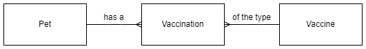

# Database Design and Development

## Notes

All the code examples use SQLite.  They will work with [DB Browser for SQLite](https://sqlitebrowser.org/).

These notes are focused on Higher Computing Science so some terms are used differently.

### Example Data

The example [database](H-CS-Database.db) contains the tables and records that the SQL examples will work with.  The file can be opened with [DB Browser for SQLite](https://sqlitebrowser.org/).

Four records from each table used in the examples are shown below.

#### Table: Pet

| petID | name     | species | dob |
| ----- | ----     | ------- | --- |
| 1     | Hans     | Cat     | 2015-09-22 |
| 2     | Minnnie  | Gerbil  | 2021-05-24 |
| 3	    | Bo       | Rabbit  | 2011-10-13 |
| 4     | Joscelin | Gerbil  | 2022-02-19 |

####  Table: Vaccination

| petID | vaxID | vaxDate    | reaction | paid |
| ----- | ----- | -------    | -------- | ---- |
| 2     | 4     | 2021-11-06 | FALSE    | FALSE |
| 20    | 9     | 2021-09-05 | FALSE    | FALSE |
| 19    | 2     | 2021-07-06 | FALSE    | FALSE |
| 9     | 8     | 2021-03-05 | FALSE    | FALSE |

#### Table: Vaccine

| vaxID | name                   | cost |
| ----- | ----                   | ---- |
| 1     | Canine hepatitis       | 27.55 |
| 2     | Cat Flu                | 19.30 |
| 3     | Distemper              | 34.75 |
| 4     | Feline Leukaemia Virus | 25.35 |

#### ER Diagram

